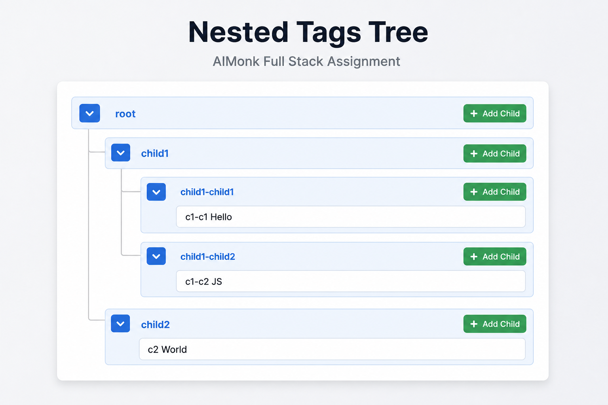
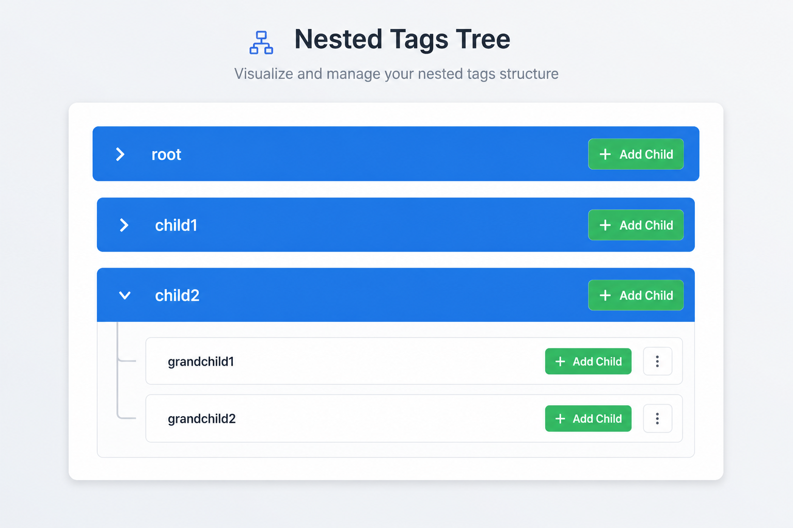
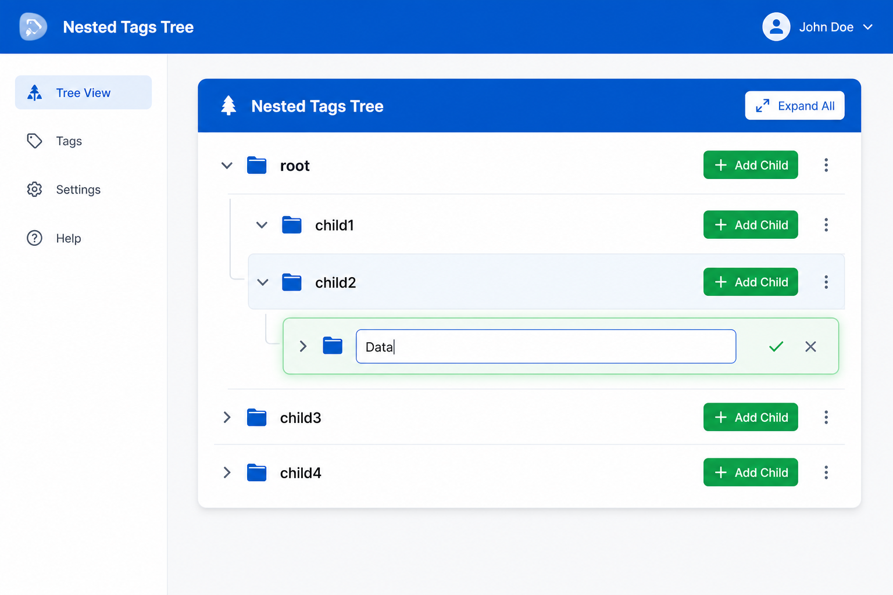
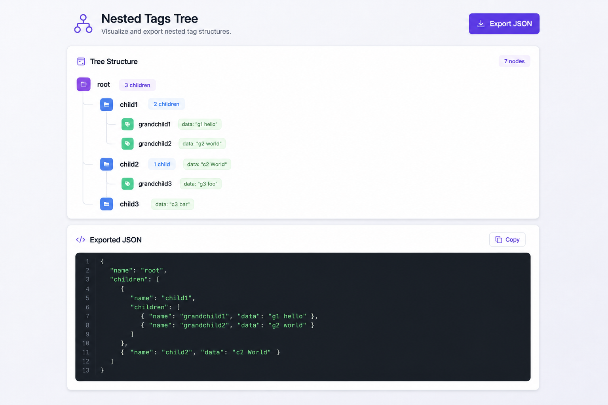

# Nested Tags Tree - AIMonk Full Stack Assignment

A full-stack web application for managing nested tag tree hierarchies with React frontend and FastAPI backend.

## Features

- **Interactive Tag Tree**: Render and manipulate nested tag hierarchies
- **Collapsible Tags**: Click v/> to expand/collapse tags
- **Editable Data**: Modify data values through text inputs
- **Add Children**: Convert data nodes to parent nodes with children
- **Editable Names**: Click on tag names to edit them (bonus feature)
- **Export & Save**: Export tree as JSON and persist to database
- **Multiple Trees**: Support for multiple saved tree hierarchies

## Screenshots

### Default Tree View


### Collapsed State


### Add Child


### Export JSON


## Tech Stack

### Frontend
- React 18 with Vite
- Tailwind CSS for styling
- Axios for API calls

### Backend
- Python 3.9+
- FastAPI
- SQLAlchemy ORM
- PostgreSQL (Supabase)

## Project Structure

```
nested-tags-tree/
├── backend/
│   ├── main.py          # FastAPI application & endpoints
│   ├── models.py        # SQLAlchemy database models
│   ├── schemas.py       # Pydantic schemas for validation
│   ├── database.py      # Database configuration
│   └── requirements.txt # Python dependencies
├── frontend/
│   ├── src/
│   │   ├── components/
│   │   │   ├── TagView.jsx   # Recursive tag component
│   │   │   └── TreeCard.jsx  # Tree container with export
│   │   ├── App.jsx      # Main application
│   │   ├── api.js       # API client
│   │   └── main.jsx     # Entry point
│   ├── package.json
│   └── index.html
└── README.md
```

## Installation & Setup

### Prerequisites
- Node.js 18+ and npm
- Python 3.9+
- pip

### Backend Setup

```bash
cd backend

# Create virtual environment (recommended)
python -m venv venv
source venv/bin/activate  # On Windows: venv\Scripts\activate

# Install dependencies
pip install -r requirements.txt

# Run the server
uvicorn main:app --reload --port 8000
```

The API will be available at `http://localhost:8000`

### Frontend Setup

```bash
cd frontend

# Install dependencies
npm install

# Run development server
npm run dev
```

The frontend will be available at `http://localhost:3000`

## API Endpoints

| Method | Endpoint | Description |
|--------|----------|-------------|
| GET | `/api/trees` | Fetch all saved tree hierarchies |
| GET | `/api/trees/{id}` | Fetch a specific tree by ID |
| POST | `/api/trees` | Create a new tree hierarchy |
| PUT | `/api/trees/{id}` | Update an existing tree |
| DELETE | `/api/trees/{id}` | Delete a tree |

## Usage

1. **View Trees**: On load, the app fetches all saved trees from the database
2. **Edit Data**: Click on text input fields to modify data values
3. **Edit Names**: Click on the blue tag name header to edit (bonus feature)
4. **Collapse/Expand**: Click v/> button to toggle visibility
5. **Add Child**: Click "Add Child" to add a new child node
6. **Export**: Click "Export" to see JSON and save to database
7. **Add New Tree**: Click "+ Add New Tree" to create a fresh tree

## Data Structure

```javascript
{
  name: 'root',
  children: [
    {
      name: 'child1',
      children: [
        { name: 'child1-child1', data: 'c1-c1 Hello' },
        { name: 'child1-child2', data: 'c1-c2 JS' }
      ]
    },
    { name: 'child2', data: 'c2 World' }
  ]
}
```

Each tag has:
- `name`: Required string identifier
- `children`: Array of child tags (mutually exclusive with `data`)
- `data`: String content (mutually exclusive with `children`)

## Database Schema

The tree hierarchy is stored as JSON in a single table:

```sql
CREATE TABLE tree_hierarchies (
    id INTEGER PRIMARY KEY,
    name VARCHAR(255) NOT NULL,
    tree_data TEXT NOT NULL,  -- JSON string
    created_at TIMESTAMP,
    updated_at TIMESTAMP
);
```

## Building for Production

### Frontend Build
```bash
cd frontend
npm run build
```

Build output will be in `frontend/dist/`

### Backend Deployment
For production, consider:
- Using PostgreSQL instead of SQLite
- Adding proper environment configuration
- Setting up CORS for specific origins
- Using a production ASGI server like Gunicorn with Uvicorn workers

## Author

Built for AIMonk Labs Full Stack Developer Interview Assignment

## License

MIT
